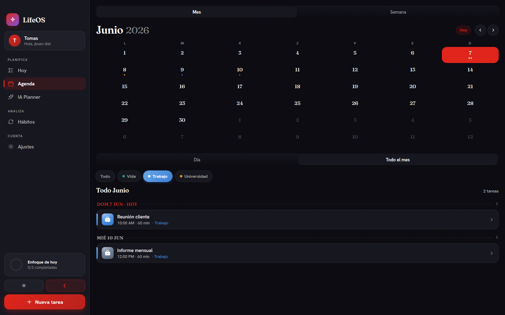
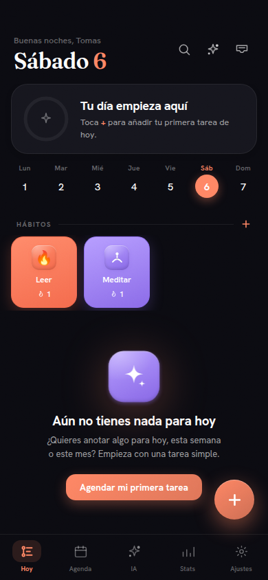

# LifeOS 

Planner diario + tracker de hábitos, mobile-first y PWA. Timeline visual del día, hábitos con
rachas, captura rápida (inbox), rutinas, modo enfoque, y un **IA Planner** que crea/mueve/completa/
borra tareas por lenguaje natural en español (texto y voz) — 100% offline, sin backend.

<p align="center">
  
  
</p>

## Funciona en
- **Teléfono** → app full-screen de una columna.
- **Desktop / tablet** → layout con sidebar.
Mismo código, layout responsivo (`App()` en `src/lifeos-app.jsx`).

## Características
- Timeline del día por secciones (mañana/tarde/noche), completar tocando el anillo, subtasks con progreso.
- Tareas recurrentes (cada día / entre semana / semanal), recordatorios, prioridad, posponer.
- Inbox de captura rápida → agendar en un toque.
- Rutinas reutilizables (Pomodoro, Día de clases, Workout…) que se agendan de una.
- IA Planner: *"gym mañana 7am 1h"*, *"reunión con Ana el lunes 10am"*, *"llamar a mamá cada día 8pm"* → tarea real.
- Agenda mensual + semanal (estilo Fantastical), pantalla **Hábitos** con heatmap de consistencia, ajustes (tema/acento/densidad), exportar/importar respaldo JSON.
- Persistencia local (`localStorage`); store sync-ready para una futura capa Supabase (cuentas + sync multi-dispositivo).

## Desarrollo (arquitectura bundle)
`index.html` es un bundle autocontenido de un solo archivo: los 9 módulos JSX se **precompilan
offline** (Babel vía `build.py` + `transpile.js`) y viajan como JS plano dentro de un manifest
gzip+base64. **Ya NO se transpila en el navegador** (sin `@babel/standalone`, CSP sin `unsafe-eval`).
**La fuente de verdad son los `src/*.jsx`.**

```bash
# 1. editar src/*.jsx
node check.js          # syntax-check (Babel) de los 9 módulos
python3 build.py       # precompila src/ -> index.html  (rebuild.py delega aquí)
python3 -m http.server 8755   # probar en http://localhost:8755
node verify-builda.js  # boot + CSP check headless (Playwright + Chrome del sistema)
```

> El **entry real** (`ReactDOM.render(<App/>)`) vive en el template inline de `index.html`;
> `build.py` lo transpila junto con los módulos, así que basta con correr `build.py` tras editar `src/`.

`check.js`, `verify-*.js`, `smoke.js`, `node_modules/` y `package*.json` son herramientas de dev
locales (ignoradas en git y en el deploy).

## Deploy
App web estática → GitHub Pages / Cloudflare Pages. Sube la carpeta; sirve `index.html` desde la raíz.

Los datos viven sólo en el navegador del dispositivo (`localStorage`).
